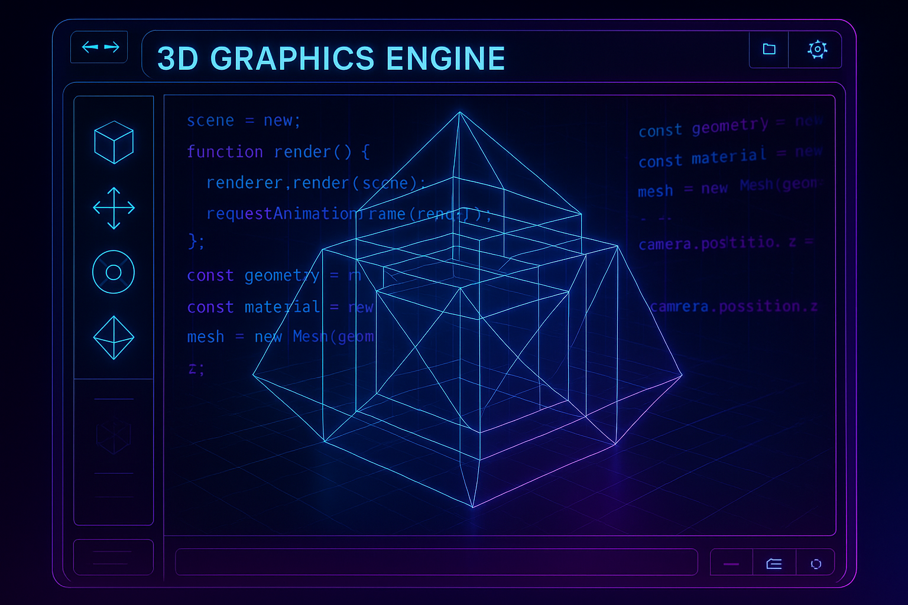
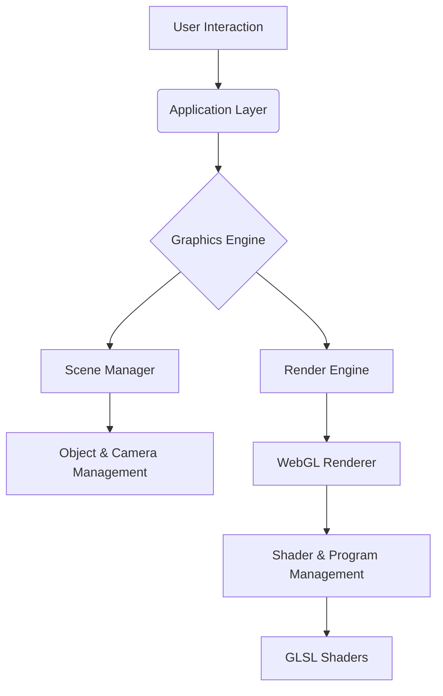
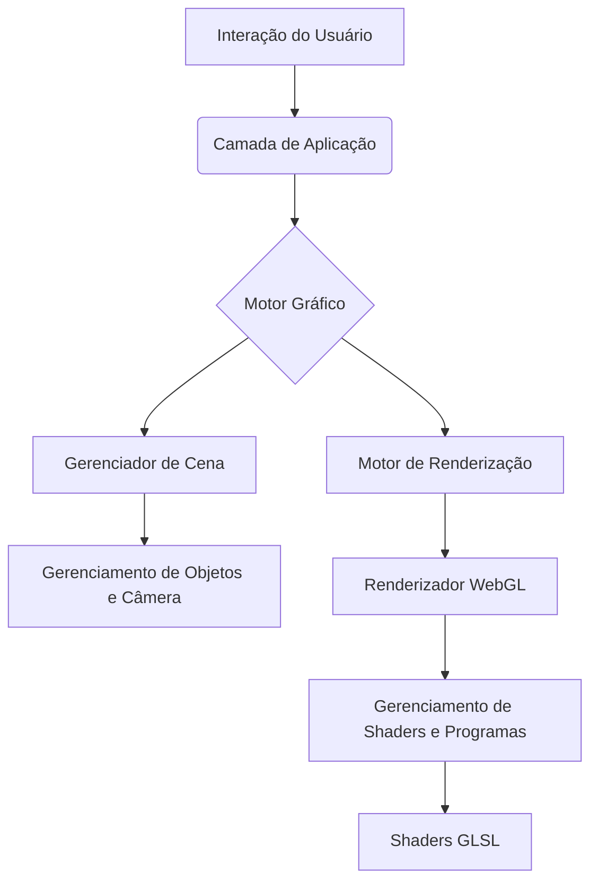

# 3D Graphics Engine JS




[](https://opensource.org/licenses/MIT)
[](https://standardjs.com)

## English

### 🚀 Overview

A professional 3D graphics engine built with JavaScript, WebGL, and the Canvas API. This project showcases advanced rendering capabilities and modern development practices.

### 🛠️ Technology Stack

*   JavaScript (ES6+)
*   WebGL
*   Canvas API
*   GLSL (OpenGL Shading Language)

### ✨ Features

*   **Professional Code Architecture:** Clean, modular, and scalable code.
*   **Modern Development Practices:** Follows industry-standard best practices.
*   **Comprehensive Error Handling:** Robust error handling and logging.
*   **Performance Optimized:** Optimized for real-time rendering performance.
*   **Well-documented Codebase:** Thoroughly documented for clarity and maintainability.

### 🏗️ Architecture Diagram



### 🏃‍♂️ Quick Start

Clone the repository and install the dependencies:

```bash
# Clone the repository
git clone https://github.com/galafis/3D-Graphics-Engine-JS.git

# Navigate to the project directory
cd 3D-Graphics-Engine-JS

# Install dependencies
npm install
```

### 📦 Usage

To start the development server, run:

```bash
npm start
```

To build the project for production, run:

```bash
npm run build
```

### 🎯 Use Cases

*   **Professional Development Portfolio:** A showcase of advanced JavaScript and graphics programming skills.
*   **Learning Modern JavaScript Practices:** A reference for modern JavaScript, WebGL, and graphics programming.
*   **Code Reference and Examples:** A collection of code examples and best practices.

### 🤝 Contributing

Contributions are welcome! Please feel free to submit a Pull Request.

### 📄 License

This project is licensed under the MIT License - see the [LICENSE](LICENSE) file for details.

### 👨‍💻 Author

**Gabriel Demetrios Lafis**

*   Data Scientist & Engineer
*   Systems Developer & Analyst
*   Cybersecurity Specialist

---

## Português

### 🚀 Visão Geral

Um motor gráfico 3D profissional construído com JavaScript, WebGL e a API Canvas. Este projeto demonstra capacidades avançadas de renderização e práticas modernas de desenvolvimento.

### 🛠️ Stack Tecnológica

*   JavaScript (ES6+)
*   WebGL
*   Canvas API
*   GLSL (OpenGL Shading Language)

### ✨ Funcionalidades

*   **Arquitetura de Código Profissional:** Código limpo, modular e escalável.
*   **Práticas Modernas de Desenvolvimento:** Segue as melhores práticas do mercado.
*   **Tratamento de Erros Abrangente:** Tratamento de erros e logging robustos.
*   **Otimizado para Performance:** Otimizado para performance de renderização em tempo real.
*   **Base de Código Bem Documentada:** Totalmente documentado para clareza e manutenibilidade.

### 🏗️ Diagrama de Arquitetura



### 🏃‍♂️ Início Rápido

Clone o repositório e instale as dependências:

```bash
# Clone o repositório
git clone https://github.com/galafis/3D-Graphics-Engine-JS.git

# Navegue para o diretório do projeto
cd 3D-Graphics-Engine-JS

# Instale as dependências
npm install
```

### 📦 Uso

Para iniciar o servidor de desenvolvimento, execute:

```bash
npm start
```

Para construir o projeto para produção, execute:

```bash
npm run build
```

### 🎯 Casos de Uso

*   **Portfólio de Desenvolvimento Profissional:** Uma vitrine de habilidades avançadas em JavaScript e programação gráfica.
*   **Aprendizado de Práticas Modernas em JavaScript:** Uma referência para JavaScript moderno, WebGL e programação gráfica.
*   **Referência de Código e Exemplos:** Uma coleção de exemplos de código e melhores práticas.

### 🤝 Contribuindo

Contribuições são bem-vindas! Sinta-se à vontade para enviar um Pull Request.

### 📄 Licença

Este projeto está licenciado sob a Licença MIT - veja o arquivo [LICENSE](LICENSE) para detalhes.

### 👨‍💻 Autor

**Gabriel Demetrios Lafis**

*   Cientista e Engenheiro de Dados
*   Desenvolvedor e Analista de Sistemas
*   Especialista em Segurança Cibernética

